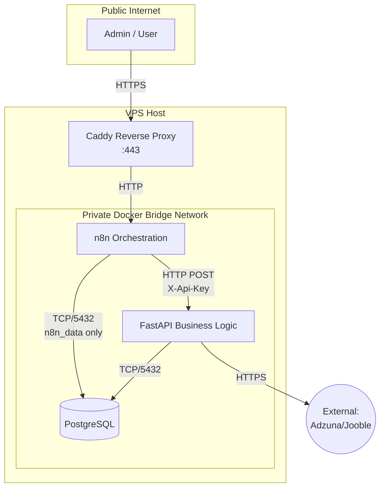

# MISSION 005.1 — JOBPILOT N8N NERVOUS SYSTEM
## DIVINE / GOD-TIER ARCHITECTURE & DESIGN SPECIFICATION

This document outlines the complete architectural design for introducing n8n as the orchestration layer (the "Nervous System") on top of the frozen JobPilot backend (the "Business Brain").

---

## PART 1 — ARCHITECTURAL RESPONSIBILITY MATRIX

| Responsibility | Owner | Reason | Why Other Layers Must Not Own It |
|---|---|---|---|
| **Scheduling** | n8n | Native cron/timer nodes designed for workflow triggering. | FastAPI is a stateless API; writing custom schedulers inside it re-invents the wheel and risks memory leaks. |
| **Search Plan** | n8n | Orchestration data (keywords, locations) dictates the *intent* of a search. | Hardcoding dynamic search targets in FastAPI requires deployments for business logic tweaks. |
| **Query Validation** | FastAPI | Domain models (Pydantic) must protect the database and canonical rules. | n8n lacks strict type-checking and should not hold domain constraints. |
| **Provider Credentials** | FastAPI | The backend directly communicates with providers to ensure quota control. | Passing provider keys through n8n JSON risks secret leakage in execution logs. |
| **Quota Enforcement** | PostgreSQL / FastAPI | Atomic transactions in the DB represent the ultimate source of truth for limits. | n8n cannot guarantee atomic counter increments during parallel workflows. |
| **Persistence** | PostgreSQL | Relational integrity, ACID compliance, and idempotency. | n8n execution history is ephemeral and easily wiped. |
| **Retries (Network)**| n8n (Orchestration) / FastAPI (Execution) | Provider requests have NO automatic retry by default. n8n only retries explicitly safe infrastructure operations. | n8n blindly retrying could bypass FastAPI's quota lock if not modeled correctly. |
| **API Authentication**| FastAPI | Validates the internal `X-Api-Key` to authorize machine-to-machine requests. | n8n is the client; it cannot authenticate itself. |
| **Provider Comm.** | FastAPI | Adapter pattern transforms external schema to internal canonical models safely. | n8n nodes for arbitrary APIs create maintenance nightmares and scatter logic. |
| **Deduplication** | PostgreSQL | `UNIQUE(source, source_job_id)` enforces strict idempotency at the lowest level. | n8n has no durable cross-execution memory of individual job IDs. |
| **Scoring** | FastAPI | Business logic belongs in the domain boundary. | n8n expressions are not designed for complex math/ML processing. |
| **Notifications** | n8n | Excellent out-of-the-box integrations (Telegram, Email, etc.). | FastAPI should not manage webhook states and notification templates. |
| **Workflow State** | n8n | Manages execution history, active nodes, and conditional paths. | FastAPI is stateless. |
| **Auditability** | n8n & FastAPI | n8n tracks *when* things ran; FastAPI logs *what* happened securely. | Relying on one loses either orchestration context or security hygiene. |

---

## PART 2 & PART 3 — TOPOLOGY & NETWORK BOUNDARIES

### Local Development Topology
Locally, the system runs inside a single Docker bridge network.
- **n8n**: Exposes port `5678` to `127.0.0.1` on the host for UI access. Needs internet access to fetch workflow templates/updates (if desired) or send notifications.
- **FastAPI**: Exposes port `8000` to `127.0.0.1` for manual testing.
- **PostgreSQL**: Exposes port `5432` to `127.0.0.1`. Does *not* need internet access.
- **Communication**: n8n reaches FastAPI via `http://fastapi:8000`. FastAPI reaches PostgreSQL via `postgresql://...db:5432`.

### Production / Oracle VPS Topology
In production, a Reverse Proxy (Caddy) sits at the edge terminating TLS for `n8n.jobpilot.cfd`.
- **Public Ingress**: Only Caddy binds to `0.0.0.0:443` and `0.0.0.0:80`.
- **Private Docker Network**: Network segmentation is tiered: Caddy talks to n8n on an edge network, n8n talks to FastAPI on a private app network, and FastAPI talks to PostgreSQL on a private DB network. (n8n also connects to the DB network exclusively for its `n8n_data` database).
- **n8n UI**: Publicly accessible via `n8n.jobpilot.cfd` but protected by strict n8n authentication.
- **FastAPI**: **NOT EXPOSED PUBLICLY**. Accessible *only* by n8n over the internal Docker network.
- **PostgreSQL**: **NOT EXPOSED PUBLICLY**. Accessible *only* by FastAPI (and strictly n8n connecting ONLY to its own `n8n_data` database, never the `jobpilot` database).

---

## PART 4 & PART 5 — PERSISTENCE & DATABASE DECISION

### n8n Database Decision
**Decision: Option A (Shared PostgreSQL Server, Separate Logical DB)**
- **Why**: Since PostgreSQL is already running for JobPilot, standing up a second database server (or relying on an embedded database (like SQLite) which suffers locking issues under concurrency) is inefficient for a small free VPS.
- **Security Boundary**: n8n will connect to the same PostgreSQL *server*, but to a completely distinct logical database (`n8n_data`) using a separate user (`n8n_user`). `n8n_user` has access strictly to the `n8n_data` database and is explicitly revoked CONNECT privileges to the `jobpilot` database.

### Persistence Strategy
n8n requires durable state across restarts for:
- Workflows (JSON definitions)
- Credentials (Encrypted)
- Execution Metadata (History)
- Settings/Keys
- **Volume Strategy**: A Docker managed volume `n8n_data` mounted to `/home/node/.n8n`.
- **Avoid Enterprise Features**: We will not use external blob storage (S3) for binary data, as it is unnecessary and skirts enterprise feature requirements.

---

## PART 6 & PART 7 — SECRET MANAGEMENT & ENCRYPTION KEY

### N8N_ENCRYPTION_KEY
- **Mechanism**: Injected via Docker environment variables (`.env`). Must be stable across restarts.
- **Risk**: If this key changes or is lost, all n8n credentials become permanently unreadable, breaking orchestration.
- **Storage**: Never committed to Git. Backed up securely alongside VPS configuration.

### Secret Handling Rules
- **FastAPI Internal Key**: Stored as an n8n Header Auth Credential. Never typed into HTTP Request nodes directly.
- **Provider Keys**: Managed entirely by FastAPI's `.env`. n8n never sees them.
- **Workflow Definitions**: Workflows exported to JSON will contain credential *references*, not the plaintext secrets.

---

## PART 8 & PART 9 — FASTAPI CONTRACT & CREDENTIAL STRATEGY

### FastAPI Authentication Contract
- **Method**: `POST`
- **Path**: `/api/v1/ingestion/{provider}` (e.g., `/ingestion/adzuna`, but backend currently uses direct router endpoints. We will adhere exactly to whatever FastAPI exposes).
- **Headers**:
  - `X-Api-Key`: `<credential>`
  - `Content-Type`: `application/json`
- **Body**: Canonical `JobSearchQuery` `{"keywords": "Python", "location": "Bangalore"}`
- **Responses**: `200 OK` (success), `401 Unauthorized` (auth fail), `429 Too Many Requests` (quota fail), `500 Internal Error` (config/provider fail), `503 Service Unavailable` (database/service down).

### n8n Credential Strategy
- **Type**: Standard Custom API / Header Auth credential in n8n.
- **Name**: `JP — FastAPI Internal API`.
- **Usage**: Mapped globally to all FastAPI HTTP Request nodes. Rotation simply involves updating this one credential object in n8n and restarting FastAPI with the new key.

---

## PART 10 & PART 11 — WORKFLOW ARCHITECTURE

### Workflow 1: JP — FastAPI Health Check
- **Trigger**: Manual
- **Node**: HTTP Request (`GET http://fastapi:8000/internal/health`)
- **Validation**: Code node validates `status === "ok"`
- **Purpose**: Validates internal network routing and basic service liveliness without touching quotas or providers.

### Workflow 2: JP — Daily Job Discovery
- **Trigger**: Schedule (e.g., 08:00 UTC).
- **Node**: Load Search Plan (Set node with array of JSON queries).
- **Sub-Workflows**: Split into batches/loops passing individual `JobSearchQuery` payloads to an execution sub-workflow.
- **Action**: HTTP Request `POST /ingestion/adzuna`.
- **Result Handling**: Classify `200` (proceed), `429` (stop provider branch), `500` (alert).

---

## PART 12 & PART 13 — SEARCH PLAN & ORCHESTRATION

- **Search Plan**: Configured in an n8n `Set` node or external JSON file read by n8n. Focuses on: "Junior Python Developer", "Django", "RAG / AI", "Bangalore".
- **Orchestration**: Adzuna executes up to 10 queries. Jooble executes 1 highly targeted query.
- **Quota Authority**: n8n *requests* the search. FastAPI *allows or denies* it. If n8n attempts 11 Adzuna searches, FastAPI returns 429 on the 11th. n8n catches this 429 and exits the loop cleanly.

---

## PART 14, 15, 16, 17 — RELIABILITY MATRICES

### Retry Policy
- **Network Timeout (n8n -> FastAPI)**: n8n only retries explicitly safe infrastructure operations (e.g., 1 retry if FastAPI is unreachable). Provider requests have NO automatic retries by default.
- **HTTP 401 (Auth)**: **NO RETRY**. Fatal config error.
- **HTTP 429 (Quota)**: **NO RETRY**. Expected exhaustion.
- **HTTP 500 (Provider Fail/Config)**: **NO RETRY**. Protects quota slots from getting burned by upstream outages.
- **HTTP 503 (Service Unavailable)**: **NO RETRY**. Abort workflow safely.

### Timeout Policy
- **n8n -> FastAPI**: 30 seconds.
- **FastAPI -> Provider**: 10 seconds (already hardcoded).

### Idempotency & Duplicate Execution
- Handled safely by PostgreSQL `UNIQUE(source, source_job_id)`. If n8n double-fires, FastAPI processes the data, but DB ingestion ignores duplicates gracefully.

### Error Handling
- **Stop Workflow**: Auth failures, Quota exhaustion, Database unavailability.
- **Continue Workflow**: A single keyword search fails, but others remain to be processed.

---

## PART 18 & 19 — OBSERVABILITY & AUDITABILITY

### n8n Execution History
- **Retention Policy**: Prune successful executions after 7 days, failed executions after 14 days. Ensures the SQLite/Postgres DB on the free VPS doesn't bloat and crash the disk.
- **Hygiene**: Ensure HTTP Request nodes masking the API key (via credentials) don't accidentally log sensitive headers.

### Observability Matrix
| Event | Owner | Where Stored | How Long | Sensitive? | Safe? |
|---|---|---|---|---|---|
| Workflow Start | n8n | n8n DB | 7 days | No | Yes |
| Provider Request | FastAPI | Docker logs | Ephemeral | No | Yes |
| Quota Rejection | FastAPI | Docker logs | Ephemeral | No | Yes |
| Job Creation | FastAPI | Postgres | Forever | No | Yes |
| Notification | n8n | n8n DB | 7 days | No | Yes |
| Auth Failure | FastAPI | Docker logs | Ephemeral | Yes (if key logged) | Yes (sanitized) |

---

## PART 20 & 21 — BACKUP, RECOVERY & RESOURCE BUDGET

- **VPS Constraints**: Oracle Always Free (typically 1GB RAM for micro, or 24GB for ARM). We assume minimal resources.
- **Budget**: No Redis, no Kafka, no Kubernetes. Just Docker Compose.
- **Backup**: 
  - `pg_dump` for JobPilot and n8n databases.
  - Never casually back up a plaintext `.env` file. Backups containing `N8N_ENCRYPTION_KEY` must be strictly protected, securely encrypted at rest, and separated from casual workflow backups.
  - Rsync to local storage or free cloud bucket.
- **Recovery**: Re-clone repo -> restore `.env` -> `docker-compose up` -> restore DB dumps.

---

## PART 22 & 23 — SECURITY HARDENING & REVERSE PROXY

### n8n Security Audit Implementation
- **Credentials**: Stored in DB, encrypted via environment key.
- **Risky Nodes**: SSH, Execute Command, and File System nodes must be disabled or strictly reviewed. No community nodes.
- **Webhooks**: Unprotected webhooks disabled. Authentication required.

### Reverse Proxy (Caddy)
- **Role**: Terminates TLS for `n8n.jobpilot.cfd`.
- **Why Caddy?**: Auto-generates Let's Encrypt certificates natively. Zero config overhead.
- **API Expsoure**: `api.jobpilot.cfd` is **NOT** created. FastAPI remains entirely dark to the internet.

---

## PART 24 - 29 — NAMING, MODULARITY & CONTRACTS

- **Domains**: We own `jobpilot.cfd`. Will point A records to VPS IP for `n8n.jobpilot.cfd`.
- **Local vs Prod**: Local uses `localhost:5678` over HTTP. Prod uses `n8n.jobpilot.cfd` over HTTPS. The internal n8n -> FastAPI URL (`http://fastapi:8000`) remains identical across both environments!
- **Naming Convention**: `JP — [Domain] — [Action]`. Example: `JP — Provider — Adzuna Search`.
- **Data Contracts**: Workflows pass simple JSON: `{"keywords": "...", "location": "..."}`.
- **Modularity**: Sub-workflows are used for repetitive tasks (e.g., executing a single provider search), invoked via the `Execute Workflow` node.

---

## PART 30 - 33 — LIFECYCLE, ROTATION & FUTURE

- **Credential Rotation**: To rotate FastAPI key -> generate new key -> update FastAPI `.env` -> update n8n Credential -> restart both. Workflows require zero code changes.
- **Failure Domain**:
  - *n8n crashes*: Scheduled runs missed. FastAPI and PostgreSQL remain healthy.
  - *FastAPI crashes*: n8n requests timeout. Providers untouched. Quota safe.
  - *PostgreSQL crashes*: Both FastAPI and n8n (if shared DB) fail. Fatal outage. Recover via backups.
- **Future Path**: When Web UI is needed, Caddy simply exposes a new `jobpilot.cfd` block routing to a frontend container, which talks to FastAPI. Current architecture fundamentally supports this.

---

## PART 34 & 35 — SOURCE CONTROL & SECURITY AUDIT PLAN

### Git / Source Control
n8n's native Git integration is an Enterprise feature.
**Alternative**: 
- Use n8n CLI or UI to export workflows as JSON files: `n8n export:workflow --all`.
- Commit these JSON files manually into a `n8n-workflows/` directory in the JobPilot repository.

### Production Security Checklist
- [ ] FastAPI port 8000 is NOT bound to `0.0.0.0` on host.
- [ ] PostgreSQL port 5432 is NOT bound to `0.0.0.0` on host.
- [ ] `N8N_ENCRYPTION_KEY` is high-entropy and backed up.
- [ ] FastAPI `API_SECRET_KEY` is high-entropy and configured in n8n.
- [ ] n8n user authentication is enabled with strong passwords.
- [ ] Caddy strictly enforces HTTPS for the n8n UI.

---

## PART 36 & 43 — IMPLEMENTATION SEQUENCE & BACKLOG

**005.1** Architecture / design -> **GATE (Complete)**
**005.2** Local Docker n8n (Add n8n and Caddy to compose, setup separate Postgres DB) -> **GATE**
**005.3** n8n -> FastAPI health handshake (First workflow) -> **GATE**
**005.4** Credentials / secret integration (Configure Header Auth) -> **GATE**
**005.5** Search plan (Create JSON static array in n8n) -> **GATE**
**005.6** Provider orchestration (Loops and branches) -> **GATE**
**005.7** Daily scheduling (Cron trigger) -> **GATE**
**005.8** Failure handling (Alerts on 500) -> **GATE**
**005.9** Retry/idempotency hardening (Test 429 quota exhaustion bounds) -> **GATE**
**005.10** Notifications (Telegram/Email basic setup) -> **GATE**
**005.11** Oracle VPS deployment (Provision infrastructure) -> **GATE**
**005.12** Production security audit -> **LIVE**

---

## PART 40 — THREAT MODEL

| Threat | Impact | Mitigation | Residual Risk |
|---|---|---|---|
| Internet Attacker targeting API | High | FastAPI is not exposed to the internet. | Low |
| Compromised n8n UI account | Critical | Strong passwords; restrict UI to trusted IPs if possible. | Medium |
| Malicious Workflow Execution | High | Disable Execute Command/Filesystem nodes. | Low |
| Provider Outage | Medium | FastAPI fails closed. n8n halts workflow. | Low |
| API Quota Abuse | Medium | Handled strictly by Postgres transactions. | Low |
| Secret Leakage in UI | High | Use n8n Credential blocks strictly. Export workflows sanitize creds. | Low |

---

## PART 41 — ARCHITECTURE DECISION RECORDS (ADRs)

1. **Why n8n?** Visual orchestration separates scheduling/intent from business logic.
2. **Why self-hosted?** $0 cost requirement and data sovereignty.
3. **Why FastAPI remains business logic?** Strict type safety, ML/Scoring capabilities, complex Python ecosystem.
4. **Why PostgreSQL remains quota authority?** ACID guarantees prevent race conditions on strict finite quotas.
5. **Why no queue mode initially?** Unnecessary complexity for a single-user system. A single n8n instance easily handles hundreds of daily requests.
6. **Why no native Git source control?** Paid feature. Manual JSON export is sufficient and free.

---

## PART 42 — DIAGRAMS

### A. NETWORK TRUST BOUNDARIES & DATA FLOW

---

## PART 44 & 45 — FAILURE CRITERIA & 005.1 GATE

### Failure / Rollback Criteria (STOP Conditions)
Stop implementation if during any phase:
- FastAPI becomes inadvertently exposed to the public internet.
- Quota is consumed erroneously during n8n retry loops.
- Workflow execution history balloons uncontrollably and risks VPS disk space.
- The `N8N_ENCRYPTION_KEY` is accidentally committed to source control.

### 005.1 GATE CHECKLIST
- [x] Responsibility boundaries defined
- [x] Network boundaries defined
- [x] Secret boundaries defined
- [x] Local topology defined
- [x] VPS topology defined
- [x] FastAPI contract defined
- [x] Persistence defined
- [x] Database strategy defined
- [x] Retry policy defined
- [x] Idempotency strategy defined
- [x] Failure strategy defined
- [x] Backup strategy defined
- [x] Resource strategy defined
- [x] Security audit defined
- [x] Search plan architecture defined
- [x] Provider orchestration defined
- [x] Implementation stages defined
- [x] Rollback strategy defined
- [x] No unnecessary infrastructure
- [x] No foundation modification required

**GATE CLEARED. DO NOT PROCEED TO 005.2 UNTIL AUTHORIZED.**

### Workflow 2: JP — Search Plan
- **Trigger**: Manual
- **Nodes**: Code nodes for data generation and deterministic validation.
- **Purpose**: Owns orchestration search intent and produces structurally validated search requests (focusing on Junior/Fresher roles in Bangalore).
- **Security Boundary**: Does NOT contact providers or FastAPI. Zero credentials or quotas are involved at this stage. FastAPI remains the eventual authoritative validator.
